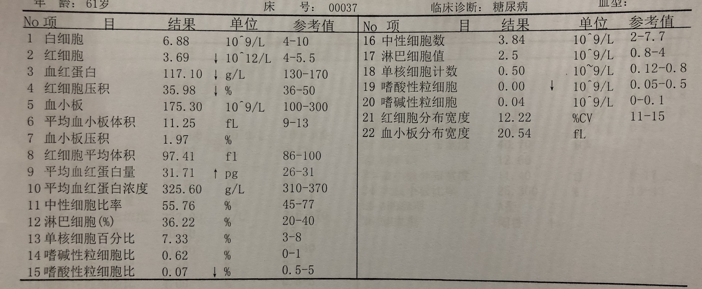

This project aims at applying and comparing some machine learning methods in predicting diabetes using Complete Blood Count results.

The methods include:

1. Decision Tree
2. SVM
3. XGBoost
4. Neural Netwrok

Meanwhile, this project utilises an OCR tool  to read structural data directly from images of Complete Blood Count reports.  A sample image is given as below.

